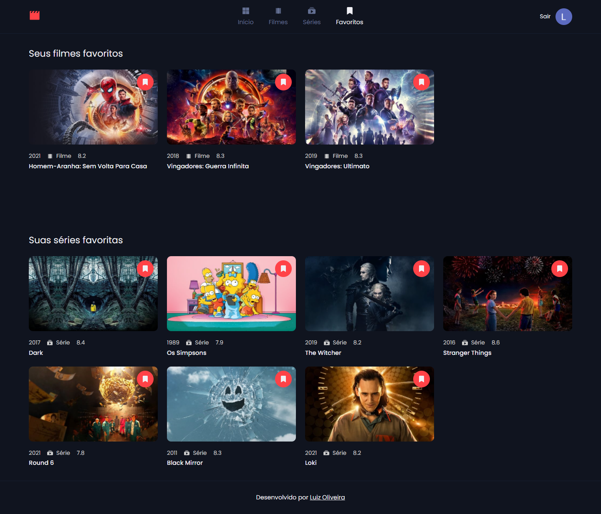

### Mediafy

Aplicação que lista filmes e séries disponibilizados pelo The Movie Database API e permite que o usuário os adicione como favoritos

Veja o resultado clicando <b><a href="https://movies-rosy-nu.vercel.app/" target="_blank">aqui</a></b>

### Funcionalidades
- Listar filmes que serão lançados ainda esse ano
- Listar os filmes e séries que são tendência no momento
- Buscar por filmes ou séries
- Ver informações do filme ou série (ano de lançamento, gênero, descrição...)
- Páginação
- Adicionar filmes e séries como favoritos
- Login com conta Google

### Imagens do projeto

##### Informações do filme ou série

##### Filmes e séries adicionados como favoritos

### Tecnologias
- Next.js
- Styled components
- React Slick
- Axios
- Firebase
